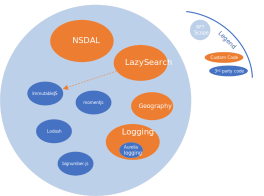
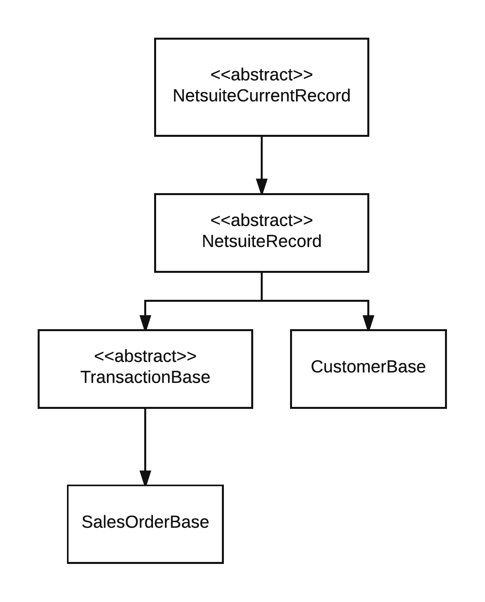

NFT (NetSuite Fasttrack Toolkit)
==============================================
_for SuiteScript 2.x_

This is a small but powerful framework for writing SuitScript that scales. A primary goal is to 
enable authoring scripts that easy to write and easy to maintain. 

_Includes_
* nsdal (Netsuite Data Access Layer) _ActiveRecord_-like approach using 
predefined and customizable strong types for NetSuite record access including sublist support. 
* advanced logging facility
* advanced search handling (search results are an arbitrarily long stream of objects)
* governance management (governance monitoring and automatic script rescheduling)

_also included (only as a convenience, NFT does not depend on these):_
* `immutablejs` - used for arbitrary length sequences and elegant search result processing)
* `lodash` - NFT enables direct use of this amazing library on NS records and search result collections)
* `momentjs` - popular date manipulation library
* `bignumber.js` - better decimal math

see `package-lock.json` for exactly which versions of the above libraries are included.

See API [docs here](https://exploreconsulting.github.io/netsuite-fasttrack-toolkit-ss2)



# Getting Started (Typescript)

Install this package as a dependency and the SuiteScript 2.x (SS2) typings from `@hitc` 

    npm install netsuite-fasttrack-toolkit-ss2 
    npm install @hitc/netsuite-types --save-dev 
    

## Deploy core library to NS
Use the NetSuite file cabinet _advanced add_ button to upload the `node_modules/netsuite-fasttrack-toolkit-ss2/dist/NFT-SS2-#.#.#.zip` 
file to the same folder in which you place your SuiteScripts. It will extract to a subfolder named NFT-SS2-#.#.#.

If you typically just put your SuiteScripts under the `/SuiteScripts/` folder in the NS file cabinet then simply 
extract the zip there. 
A recommended practice is to put your SuiteScript 2.0 files under a subfolder, such as `SuiteScripts/SS2/`. This 
creates a convenient _'root'_ folder for your SS2 projects.

After install you should get a folder link at your project root named NFT-SS2-#.#.#
This creates a folder structure mirroring what you have in NetSuite so you can use relative paths when you 
`import` from the library (e.g. `import {CustomerBase} from "./NFT-SS2-1.2.3/DataAcess/CustomerBase`)


## NetSuite Data Access Layer (NSDAL)
NSDAL is a variation of the Active Record pattern for working with NetSuite records. It removes boilerplate code and simplifies 
access to NetSuite body fields, sublists, and even subrecords; all reduced to simple objects and properties familiar
to all javascript developers. 

Behind the scenes, NSDAL is a thin wrapper eliminating boilerplate code (e.g. `getValue({fieldId:'foo'}`. 
It still calls all the normal NetSuite APIs.


NSDAL defines NetSuite record types in a class hierarchy. You can use the xxxBase classes directly if you don’t need custom fields. 
Otherwise you derive your own class and add custom fields as shown in the code example that follows.

Subrecord support! Take a look at the `CustomerBase.addressbook` sublist.
`CustomerBase.addressbook[0].addressbookaddress` gets the strongly typed `AddressBase` SubRecord. It works mostly like any 
other record you just don't explicitly `save()` it. 

Works with SuiteScript 2.0 and 2.1. 

###  Overview Example

```typescript


/**
 * Test file for SuiteScript 2.0 
 * (replace 'NFT/' below with the relative path to your NFT-SS2-x.y.z folder)
 * @NApiVersion 2.x
 * @NScriptType Suitelet
 */

import * as LogManager from 'NFT/EC_Logger'
import {CustomerBase} from  'NFT/DataAccess/CustomerBase'
import {FieldType} from 'NFT/DataAccess/Record'
import {SublistFieldType,Sublist,SublistLine} from 'NFT/DataAccess/Sublist'
import * as _ from 'NFT/lodash'

// each script should request the DefaultLogger
var log = LogManager.DefaultLogger

/**
* Define fields for the 'contactroles' sublist on customer
*/
class ContactRolesSublist extends SublistLine {
   // the country internal id
   @SublistFieldType.select
   role: number

   // adding `Text` suffix to field name surfaces the text value
   // instead of internalid
   @SublistFieldType.select
   roleText: string
}

/**
 * define a customer class for our NetSuite account including custom fields. Standard fields come from customer.Base 
 * so we don't have to repeat them here. This Customer class could be in a separate file/folder (e.g RecordTypes/Customer.ts) and 
 * reused across all scripts via `import {Customer} from "./RecordTypes/Customer"`
 */
class Customer extends CustomerBase {
   @FieldType.multiselect
   custentity_multiselect:number[]

   @FieldType.datetime
   custentity_shawn_date : Date
   
   // add 'Text' suffix to any property to `getText()` instead of `getValue()`
   @FieldType.datetime
   custentity_shawn_dateText: string
   
   @FieldType.sublist(ContactRolesSublist)
   contactroles: Sublist<ContactRolesSublist>
}


export = {

   onRequest: (req, resp) => {

      // load customer internal id 1542
      var c = new Customer(1542)

      // strongly typed field access
      c.companyname = 'a new company name'
      c.custentity_multiselect = [1, 2]
      c.custentity_a_date = new Date()
      // access `role` field VALUE of first contact role 
      c.contactroles[0].role 
      // access `country` field TEXT of first contact role
      c.contactroles[0].roleText

      // persist changes
      c.save();

      // just log a couple properties from our customer object
      log.debug('customer', _.pick(c,['custentity_a_date', 'companyname']))
      
      // address book - including experimental subrecord access
      // get addressbook subrecord of first address on the customer
      const addrSubRecord = c.addressbook[0].addressbookaddress
      // addrSubRecord has fields like addr1, addr2, city, country, state, addrphone etc.
      log.debug('address subrecord', addrSubRecord)
   }
}

```

**see also [`example.ts`](https://github.com/ExploreConsulting/netsuite-fasttrack-toolkit-ss2/blob/master/example.ts)**

NetSuite record definitions are contained in a class hierarchy to simplify defining them. You generally only work with 
the bundled base classes, or derive your own e.g. use `CustomerBase` directly or define `class Customer extends CustomerBase`
as shown in the example above.



## Custom Records
Defining custom records is similar to standard records but you inherit from `NetSuiteRecord` and
define the `recordType()` method.

```typescript
export class MyCustomRecord extends NetsuiteRecord {
 static recordType () { return 'customrecord_myrecord' }

 /**
  * Custom Name
  */
 @FieldType.freeformtext
 custrecord__name: string
}


```

See the `CodeGeneration/` folder for information on generating these custom record classes automatically. 

## Sublists and Subrecords

Use `@FieldType.subrecord` and `@SublistFieldType.subrecord` to designate fields that
point to NetSuite subrecords. Use them similarly to the `sublist` field type.

Initially we have `Address` and `InventoryDetail` subrecords defined.

This lets you work with subrecords as plain javascript objects just like the rest of
NSDAL. e.g.
        
        const build = new AssemblyBuild(123)
        
        // reading the quantity field of the InventoryDetail body field on Assembly Build record 
        build.inventorydetail.quantity 
       
### Body/Sublist Field Name Conflicts
A _body_ field name can conflict with a sublist name (e.g. "currency" can be both a body level field name and a sublist 
name on some record types). 

To work around this, add a `Sublist` suffix to your sublist field name in the class definition. For example:

```typescript
import { SublistFieldType } from './Sublist'
import { CurrencySublist } from './CustomerBase'
import { FieldType } from './Record'

class Customer {

  @Sublist(CurrencySublist)
  currencySublist: Sublist<CurrencySublist>

  @FieldType.select
  currency: number
}

```

#### Sublist Dynamic Mode vs Standard Mode
By default, dynamic mode APIs (e.g. `set**Current**SublistValue()`)) are used if the record itself is in dynamic mode.
This is _usually_ what you want. In some cases it's beneficial to use _standard mode_ API even if the record itself
is in _dynamic mode_ (e.g. reading the `apply` sublist on a `VendorPayment`). To temporarily turn off dynamic mode APIs
for sublist access set `useDynamicModeAPI = false` on the sublist property.

```typescript
import { VendorPaymentBase } from './VendorPaymentBase'

// assume this is in a dynamic record context, like a client script.
// the NetSuite record is in dynamic mode, so by default NFT uses dynamic mode API calls.
const vp = new VendorPaymentBase(ctx.newRecord) 
// temporarily turn off dynamic mode - hence uses standard mode APIs 
vp.apply.useDynamicModeAPI = false
// do something with lines of the `apply` sublist 
log.debug('first apply line', vp.apply[0])
vp.apply.useDynamicModeAPI = true // reset back to dynamic mode API calls
```

## Search Helpers

`nsSearchResult2obj` turns a netsuite `search.Result` into a POJO, especially useful when chaining operations or returning
search results from an API. 

```typescript

import {nsSearchResult2obj} from "NFT/search"
import * as search from "N/search"

const s = search.load({ id: 'somesearchid' } ).run().getRange({start:0, end:1000})
const objects = _.map(s,nsSearchResult2obj()).toArray()

// objects will be array of plain javascript objects with property names matching the field names in netsuite.
// fields with a non-falsey 'Text' value surface as properties suffixed with "Text"
// e.g. `result.fieldname` or `result.fieldnameText`

// see inline help for more (e.g. support for column labels

```

### Lazy Search ###
While `nsSearchResult2obj()` is useful on its own, we usually use it with `LazySearch`. This adds powerful and _lazy_ processing of
search results. Here 'lazy' means records are paged in from the search, as needed, never consuming more than 1 page 
in memory at a time. Contrast this with `underscore` or `lodash` which create complete copies of the target collection
for each chained operation by default.

For example `_.map(searchResults, ...)` creates a __new collection__ in memory holding the output of the `map`, 
doubling overall memory use (`searchResults` remains unchanged, and `map()` emits a new collection of the same
length as `searchResults`)

`LazySearch` processes one result at a time, passing it through all chained operation methods. It never creates intermediate
collections or exceeds 1 page of results stored in memory. This bounded memory usage holds true whether there are 1 or 
1 million search results. The limitation is `LazySearch` is intended for _forward-only_ iteration of search results - which we
 find is overwhelmingly the most common use case.

```typescript
import {nsSearchResult2obj, LazySearch} from "./search"
import {Seq} from "immutable"

// get the first result as a POJO 
let firstResultAsObj = Seq(LazySearch.load("123")).map(nsSearchResult2obj<{foo,bar}>()).first()
```


Also see [search](https://exploreconsulting.github.io/netsuite-fasttrack-toolkit-ss2/modules/search.html) in the API documentation,
especially the `LazySearch` class.

### Lazy Query ###

`LazyQuery` offers functionality similar to that of `LazySearch`, with the key distinction being that `LazyQuery` leverages suiteQL’s advanced query capabilities.
This enables us to extend the standard query operations by utilizing Lazy processing to handle data.


`LazyQuery` requires two distinct parameters to specify the search query:

The first is an object designed to mimic standard N/query functionality, and the second is the page size. </br>
1. `query`: A suiteQL string that specifies the search criteria.</br>
`parameters`: (Optional) These are values passed into the suiteQL string.
  
2. `pageSize`: (Optional) The user defines the page size for the results. Default value: 500, Maximum value : 1000. 

`nsQueryResult2obj` outputs the results in an object format that is easy to process.


```typescript
import {nsQueryResult2obj, LazyQuery} from "./query";
import {Seq} from 'immutable'

// get the ids of all customers with a specific subsidiary
const customers = Seq(LazyQuery.from({query: `SELECT ID AS FOO FROM Customer WHERE subsidiary = ?`, params: [1]}, 50)).map(nsQueryResult2obj)
```

### Governance ###
The governance handler utilities can be used with any script, but most often are used with a saved search in 
a scheduled script.

There are two functions, one for checking governance usage (`governanceRemains()`) and another which additionally
auto-reschedules the currently executing script (`rescheduleIfNeeded()`)

`governanceRemains` supports parameters for setting thresholds on both time and units usage. See the tsdocs for more on this function.

`rescheduleIfNeeded` executes the passed predicate, and if it returns false it automatically 
reschedules the script (using `N/task`) passing along script parameters if provided.

Example: exit processing automatically when governance falls below time or units threshold.
```typescript
import {nsSearchResult2obj, LazySearch} from "./search"
import {governanceRemains, rescheduleIfNeeded} from "./governance"
import {Seq} from "immutable"


// process results from search id '123' until out of governance. Governance checks are run for each iteration of the 
// `forEach()` and gracefully exit. 
Seq(LazySearch.load("123")).takeWhile(governanceRemains()).map(nsSearchResult2obj()).forEach( result => {
   // .. do something with search result. 
})


// same as above, but with automatic graceful exit AND rescheduling
Seq(LazySearch.load("123"))
   .takeWhile( rescheduleIfNeeded(governanceRemains()) )
   .map(nsSearchResult2obj<{foo,bar,baz}>())
   .forEach( result => { 
   // .. do something with search result. 
   })

```
Also see [governance](https://exploreconsulting.github.io/netsuite-fasttrack-toolkit-ss2/modules/_governance_.html) API docs

## Logging
NFT provides an advanced logging mechanism based on [Aurelia's](https://github.com/aurelia/logging) logger. 

It means you can have multiple loggers and control the logging verbosity of each. In other words, it's a lightweight
but much richer logging facility than the NetSuite provided logger.

### AutoLogging
Automatically log entry and exit of methods with rich options by adding a line like this to the end of your script:

```javascript
LogManager.autoLogMethodEntryExit({target:EC,method:/\w/}, { withProfiling:true })
```
The above line will automatically log all methods defined on the _EC_ object/namespace

Other configuration options include automatic logging of execution time, governance usage, and other goodies.

See the jsdoc help for `autologMethodEntryExit()`

# Contributing
Please do.

# TypeScript
This is written with TS and is recommended. However, it can be used by javascript clients as well.

Configure tsconfig to include `paths` for NetSuite modules and NFT modules:

```json 
{
  "paths": {
    "N/*": [
      "node_modules/@hitc/netsuite-types/N/*"
    ]
  }
}
```


## NetSuite Module Declarations
* Typescript definitions (_N/*.d.ts_ files) are defined via the 
[@hitc/netsuite-types](https://www.npmjs.com/package/@hitc/netsuite-types) project


# Tests
The `test/` folder is configured to use `ts-jest` to compile the sources.

to run the test suite:

    npm test
    

# For Contributors
The following are useful if you're contributing to the codebase and publishing to NPM
Skip this section if you're just using NFT in your projects. 

## Build and Publish 
    
    node_modules/.bin/tsc
    node_modules/.bin/gulp
    node_modules/.bin/gulp declarations
    node_modules/.bin/gulp docs
    npm publish

Don't forget to assign an appropriate version number in `package.json` then git tag the 
release with that version number and push.

## Build API docs (hosted on Github Pages)

    node_modules/.bin/gulp docs
